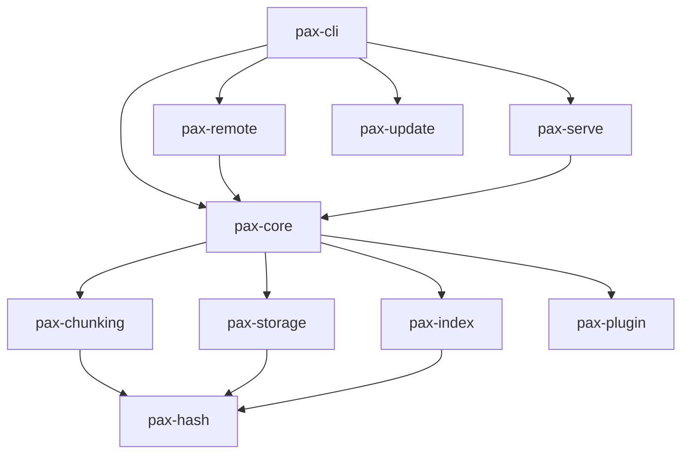

# PAX Architecture

PAX is a Cargo workspace of focused crates under `Pax/crates/`. Each crate
has a single responsibility so the engine stays testable and so contributors
can reason about one concern (hashing, chunking, storage, indexing, remote
transport, serving, CLI) at a time.

## Crates

- **pax-hash** — Newtype wrappers (`ChunkHash`, `ObjectId`, `FileHash`,
  `SnapshotId`) around BLAKE3-256 digests, plus a streaming hasher so large
  files are never hashed by loading them fully into memory.
- **pax-chunking** — Deterministic content-defined chunking via FastCDC
  (2020), streaming over any `Read` implementation.
- **pax-storage** — The sharded, zstd-compressed, content-addressed object
  store with atomic (write-temp-then-rename) writes, plus the `.pax`
  pack/unpack container format (zstd-compressed tar with a small magic
  header).
- **pax-index** — The SQLite-backed (via `rusqlite`, bundled) local index:
  snapshots, per-snapshot file lists, the file-hash-to-chunk map, staged
  changes, and named refs. All multi-row writes happen inside a single SQL
  transaction.
- **pax-plugin** — The Level 1 (opaque) / Level 2 (metadata: size, mime
  type, hash) / Level 3 (deep, plugin-provided insight) trait boundary. PAX
  core never depends on a specific creative application; future
  Blender/Unreal/Godot-aware plugins implement `PaxPlugin`.
- **pax-core** — The repository engine: `init`, `status`, `add`, `commit`,
  `log`, `diff`, `restore`, `checkout`, `verify`, `gc`, `pack`,
  `extract_plain_files`, plus the canonical JSON snapshot manifest format
  shared with `pax-remote` and `pax-serve`.
- **pax-remote** — The `RemoteTransport` trait plus two real
  implementations: `LocalDirRemote` (another `project.pax` directory, e.g.
  on a network share or USB drive) and `HttpRemote` (talks to `pax serve`).
  `push`/`pull`/`clone_repository` are transport-agnostic and work against
  either.
- **pax-serve** — A local, dependency-light HTTP server (`tiny_http`)
  exposing objects/snapshots/refs for `pax serve` and `HttpRemote`, plus a
  read-only FUSE filesystem (`fuser`, Unix only) for `pax mount` that
  reconstructs file contents on demand, chunk by chunk.
- **pax-update** — Wraps the `self_update` crate for `pax update`, plus a
  rate-limited (once per day, cached to disk) passive version check that
  runs on a background thread so it never slows down a command.
- **pax-cli** — `clap`-derive argument parsing, the mustard/cardboard
  terminal theme (`crossterm` + `console`), `indicatif` spinners, and
  command dispatch into the crates above.

## Automation scripts (`FunctionsScriptsExe/`)

| Script | Purpose |
| --- | --- |
| `build.bat` | Build a release binary for the host platform. |
| `build_all_targets.bat` | Cross-compile for all supported release targets (uses `cross` if available). |
| `test.bat` | Run the full workspace test suite. |
| `lint.bat` | Run `cargo fmt --check` and `cargo clippy -D warnings`. |
| `format.bat` | Auto-format the entire codebase. |
| `package.bat` | Collect built binaries into `dist/` and generate `SHA256SUMS`. |
| `release.bat` | Full pipeline: lint, test, bump version, build all targets, package, tag, publish everywhere. |
| `publish_github.bat` | Create a GitHub Release and upload every artifact + checksums via `gh`. |
| `publish_homebrew.bat` | Regenerate and push the Homebrew tap formula. |
| `publish_scoop.bat` | Regenerate and push the Scoop bucket manifest. |
| `publish_winget.bat` | Generate winget manifests and push a branch for a `microsoft/winget-pkgs` pull request. |
| `publish_apt.bat` | Build a `.deb` and update a self-hosted APT repository via `reprepro`. |
| `clean.bat` | Remove all build artifacts (`target/`, `dist/`). |

Each script is self-contained, can be run independently, prints a clear
success/failure line, and returns a non-zero exit code on failure.

## Data safety principles enforced in code

1. **Content addressing everywhere** — objects, files, and snapshots are all
   identified by BLAKE3 hashes of their own content, so integrity checks
   (`pax verify`) are exact and cheap to reason about.
2. **Atomic writes** — every mutation to the object store, `config.toml`,
   snapshot manifests, and ref files is a write-to-temp-then-rename, never
   an in-place write.
3. **Transactional index** — every multi-row SQLite write happens inside a
   single transaction, so a crash mid-commit cannot leave the index half
   updated.
4. **Conservative GC** — `pax gc` computes the full reachable chunk set from
   every snapshot and every staged file before deleting anything.
